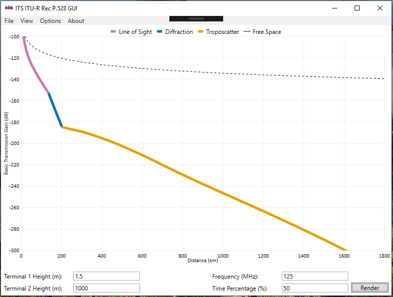

# NOTICE!
**Please note that this software is based on a proposed update to ITU-R Recommendation P.528 which will be considered during the May 2019 ITU-R Study Group 3 meetings.  The current in-force Recommendation is P.525-3 (not P.528-4).  This code could undergo changes, including but not limited to breaking and functional changes, up until the conclusion of the Study Group 3 meetings, based on the outcomes of the meetings.**

---

# Rec P.528-4 Curve Visualizer Tool #

This repo contains a Graphical User Interface (GUI) frontend to [ITU-R Recommendation P.528-4](https://www.itu.int/rec/R-REC-P.528/en).  It uses the [U.S. Reference Implementation](https://github.com/NTIA/p528) of the model to render curves relating distance to propagation loss.

## Summary of Software ##

This repo contains a simple frontend Graphical User Interface (GUI) for ITU-R Recommendation P.528.  It allows a user set the model input parameters and generate a curve relating distance with loss.  In additional, this program allows the user to identify the three modes of propagation (Line-of-Sight, Diffraction, and Troposcatter), as well as allowing the user to export the curve to a CSV data file.

## Inputs #

 * Height of the low terminal, in meters. Must be greater than or equal to 1.5 meters.
 * Height of the high terminal, in meters.  Must be greater than or equal to 1.5 meters.
 * Frequency, in MHz.  The lowest frequency is 125 MHz and the heightest frequency is 15 500 MHz.
 * Time percentage, which must be from 1 to 99.
 
The below image shows the tool rendering a curve with a low terminal height of 1.5 meters and a high terminal height of 1000 meters, for signal at 125 MHz at a 50% time percentage.  This corresponds to one of the curves shown in Figure 1-4a in the P.528 Recommendation.  The data representing this curve can be exported to a CSV data file through selecting the corresponding option in the File menu.
 

## Distribution #

To aquire a pre-built executable of this tool, navigate to the [Releases](https://github.com/NTIA/p528-gui/releases) page and download the most recent release.  Once downloaded, unzip the `.zip` file and place all files in the same folder.  Double-click on the `.exe` file to launch the application.

## Dependencies #

The tool is built on the .NET Framework and Windows Presentation Foundation, and is thus limited to execution on Microsoft Windows.  It uses the [Live Charts](https://github.com/Live-Charts/Live-Charts) package for the rendering of the plot.  As previously stated, this tool uses the [U.S. Reference Implementation](https://github.com/NTIA/p528) of the P.528 model to generate the loss values.

# Contact #

For questions, contact Billy Kozma, (303) 497-6082, wkozma@ntia.gov
