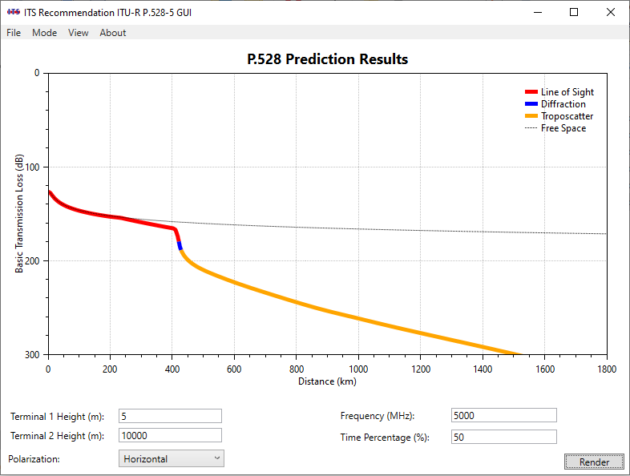

# Rec ITU-R P.528 GUI #

Persistent Identifier: 

This code repository contains a Graphical User Interface (GUI) frontend to the [U.S. Reference Implementation](https://github.com/NTIA/p528) of Recommendation ITU-R P.528.  It allows a user to set input parameters and generate a loss-versus-distance curve with modes of propagation (Line-of-Sight, Diffraction, and Troposcatter) identified.

## Inputs ##

 * Height of the low terminal
 * Height of the high terminal
 * Frequency
 * Time percentage
 * Polarization
 
 See [p528](https://github.com/NTIA/p528/blob/master/README.md#inputs) for additional details on these input parameters.

## Outputs ##

The image below illustrates p528-gui for an example set of input parameters.  The data representing this figure can be exported to a CSV data file.
 

## Configure and Build ##

The tool is built on the .NET Framework and Windows Presentation Foundation, and is thus limited to execution on Microsoft Windows.  It uses the [OxyPlot](https://oxyplot.github.io/) package for the rendering of the plot.

## Install ##

To aquire a pre-built executable of this tool, navigate to the [Releases](https://github.com/NTIA/p528-gui/releases) page and download the most recent release.  Once downloaded, unzip the `.zip` file such that all the files are in the same folder.  Double-click on the `.exe` file to launch the application.  Recommendation ITU-R P.528 comes bundled with the executable.

## References ##

 * [Recommendation ITU-R P.528](https://www.itu.int/rec/R-REC-P.528/en)
 * [U.S. Reference Implementation of Recommendation ITU-R P.528](https://github.com/NTIA/p528)
 
## Contact ##

For questions, contact Billy Kozma, (303) 497-6082, wkozma@ntia.gov
